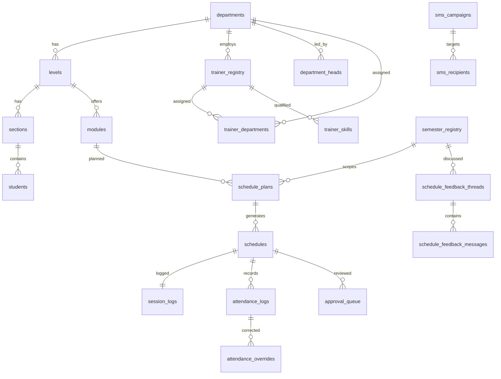

# TVET ERP — CURRENT SYSTEM MASTER REGENERATION BLUEPRINT

Forensic extraction from the live codebase + live database. Read-only. No feature was
invented; anything unconfirmed is marked `NOT VERIFIED IN CURRENT CODEBASE`.

Companion artefact: `docs/sql/tvet_erp_full_schema.sql` — full runnable DDL
(14 enums, 32 tables, all FKs, indexes, constraints, 73 RLS policies, 39 functions,
all triggers, grants, storage bucket + policies, realtime publication).

---

## 1. SYSTEM IDENTITY

| Item | Value |
|---|---|
| System name | TVET ERP (Academic ERP for a TVET college) |
| Purpose | Academic scheduling, approval workflow, attendance capture, student/trainer registries, reporting, SMS/contact book, audit |
| Architecture | Full-stack React SSR app; typed RPC server functions; Postgres-first business logic (SECURITY DEFINER RPCs); RLS as the security boundary |
| Frontend | React 19, TanStack Router (file-based) + TanStack Start v1, TanStack Query v5, Tailwind v4 (CSS-var theme), shadcn/Radix, lucide, recharts, sonner |
| Backend | TanStack Start `createServerFn` (Cloudflare Workers runtime, `nodejs_compat`), Vite 7 build, entry `src/server.ts`, `wrangler.jsonc` |
| Database | Supabase Postgres (project ref stored in `supabase/config.toml`) |
| Auth | Supabase Auth (email/password), bearer token attached client-side, validated per server-fn request |
| State | TanStack Query (`staleTime` 30s default) + React context `AuthProvider` |
| Realtime | Supabase Realtime `postgres_changes` on 15 published tables |
| Offline | Dexie (IndexedDB) outbox + idempotent server RPC |
| Docs/export | jspdf + jspdf-autotable, xlsx |
| Agent surface | `@lovable.dev/mcp-js` MCP server at `/mcp` (OAuth-protected) |
| Deployment | Lovable hosting on Cloudflare Workers |

Key dependency versions: react 19.2, @tanstack/react-router 1.168, @tanstack/react-start 1.167,
@tanstack/react-query 5.83, @supabase/supabase-js 2.105, tailwindcss 4.2, dexie 4.4,
zod 3.24, jspdf 4.2, xlsx 0.18, vite 7.3, typescript 5.8.

---

## 2. EXACT CODEBASE MAP

```
PROJECT
├── src/
│   ├── routes/                      file-based routes (routeTree.gen.ts is generated)
│   │   ├── __root.tsx               html shell, head meta, QueryClientProvider, AuthProvider, Toaster, OfflineBanner, NotFound + Error components
│   │   ├── index.tsx                landing; redirects signed-in user to role home
│   │   ├── login.tsx                sign-in
│   │   ├── _authenticated.tsx       ssr:false; renders <AuthGate><Outlet/></AuthGate>  (NO beforeLoad by design)
│   │   ├── _authenticated/strategic.tsx      MA workspace layout -> StrategicShell
│   │   ├── _authenticated/strategic/*.tsx    16 MA screens
│   │   ├── _authenticated/operational.tsx    DH workspace layout (inline shell)
│   │   ├── _authenticated/operational/*.tsx  8 DH screens
│   │   ├── _authenticated/ground.tsx         Trainer mobile shell (max-w-md, bottom tabs, trainer-theme)
│   │   ├── _authenticated/ground/*.tsx       6 trainer screens
│   │   ├── _authenticated/profile.tsx        shared self-profile
│   │   ├── _authenticated/print.$report.tsx  printable report view
│   │   ├── manual.tsx, manual/*              standalone user manual (scoped .manual-theme)
│   │   ├── api/public/sms-dispatch.ts        unauthenticated cron endpoint -> runDueCampaigns()
│   │   ├── mcp.ts, [.mcp]/*, [.well-known]/* MCP + OAuth resource metadata
│   ├── lib/
│   │   ├── *.functions.ts           ~25 server-function modules (see §11)
│   │   ├── auth/                    auth-provider.tsx, require-role.ts, roles.ts, telemetry.ts, health.functions.ts
│   │   ├── scheduling/engine.ts     THE canonical session/week engine (pure, tested)
│   │   ├── offline/db.ts, queue.ts  Dexie schema + outbox flush
│   │   ├── sms/provider.server.ts, dispatch.server.ts
│   │   ├── phone.ts, phone-uniqueness.server.ts
│   │   ├── errors/explain.ts, import-report.ts, toast.ts
│   │   ├── report-export.ts, session-report-pdf.ts, xlsx-templates.ts
│   │   ├── master-data.ts, auth-routing.ts, mcp/
│   ├── hooks/                       use-me, use-auth-session, use-master-data, use-form-submit,
│   │                                use-dh-schedule-live, use-live-tables, use-dh-live-channel,
│   │                                use-geo-gatekeeper, use-offline-sync, use-mobile
│   ├── components/                  auth/auth-gate.tsx, strategic/strategic-shell.tsx, erp/*, forms/*,
│   │                                trainer/ui.tsx, reports/*, manual/*, role-switcher, notifications-bell,
│   │                                week-timetable-dialog, feedback-chat, approval-*, csv-dropzone, ui/* (shadcn)
│   ├── integrations/supabase/       client.ts, client.server.ts, auth-middleware.ts, auth-attacher.ts, types.ts  (ALL GENERATED)
│   ├── start.ts                     errorMiddleware (request) + attachSupabaseAuth (function)
│   ├── router.tsx                   QueryClient staleTime 30_000, scrollRestoration
│   ├── server.ts, styles.css
├── supabase/config.toml
├── wrangler.jsonc                   compatibility_date 2025-09-24, nodejs_compat, main src/server.ts
└── vite.config.ts, tsconfig.json, components.json, eslint.config.js
```

File → responsibility (only reconstruction-relevant files):

| FILE | PURPOSE | DEPENDS ON |
|---|---|---|
| `src/lib/scheduling/engine.ts` | Pure deterministic plan generator: required sessions, per-week stacking, week numbers, end date, shortfall | none |
| `src/lib/semester-builder.functions.ts` | DH builder options, trainer load, validation, atomic draft save | engine.ts, RPC `dh_save_schedule_plan` |
| `src/lib/semester-drafts.functions.ts` | Draft listing grouped by module/level/section (Weekly + Full-Module views) | schedules, schedule_plans |
| `src/lib/data.functions.ts` | `getMe`, MA stats, CRUD for departments/levels/sections/semesters/venues, approval helpers | audit_logs |
| `src/lib/users-admin.functions.ts` | MA user administration (create, roles, dept, phone, email, active, bypass geofence) | RPCs `admin_*` |
| `src/lib/trainer.functions.ts` | Trainer day view, schedule detail, check-in, end session, batch submit, server time | RPCs `trainer_*`, `submit_session_batch` |
| `src/lib/offline/queue.ts` | Outbox flush + backoff + status transitions | dexie db.ts, trainer.functions |
| `src/hooks/use-dh-schedule-live.ts` | Single DH realtime channel → query-root invalidation | supabase client |
| `src/components/auth/auth-gate.tsx` | Session-ready gate, suspended-account force sign-out | use-auth-session, use-me |
| `src/lib/auth/require-role.ts` | Server-side RBAC check + forbidden telemetry | user_roles, auth_events |

---

## 3. EXACT DATABASE BLUEPRINT

Authoritative DDL: **`docs/sql/tvet_erp_full_schema.sql`** (runnable as one migration).
32 tables, all in `public`. Summary below; exact types/defaults/constraints are in the SQL file.

### 3.1 Enum types (14)

```
app_role            MA | DH | T
approval_decision   pending | approved | rejected
approval_type       semester | session
entity_active       ACTIVE | INACTIVE
entity_status       ACTIVE | SUSPENDED
leave_status        PENDING | APPROVED | REJECTED
level_name          I | II | III | IV | V
module_type         Theory | Practical | Both
notification_type   PUSH | EMAIL | SMS | IN_APP
schedule_status     DRAFT | PENDING | FEEDBACK_REQUIRED | LIVE | COMPLETED | CANCELLED | ARCHIVED | PENDING_MA | ACTIVE | ENDED
semester_status     ACTIVE | CLOSED | ARCHIVED | DRAFT | PENDING_MA | LIVE | ENDED
session_mode        Theory | Practical | Both
session_status      LIVE | COMPLETED
venue_type          Workshop | Lab | Classroom
```

### 3.2 Table inventory (purpose + key columns)

| TABLE | PURPOSE | NOTABLE COLUMNS | FKs |
|---|---|---|---|
| `departments` | Academic departments | name, code, description, status(entity_status) | — |
| `levels` | Level I–V per department (auto-seeded by trigger) | name(level_name), display_name, status | department_id |
| `sections` | Class sections inside a level | name | level_id, department_id |
| `modules` | Module registry | code, name, type(module_type), qualifications[], total_hours, total_sessions, status(entity_active) | level_id, department_id |
| `venues` | Rooms/labs/workshops with geofence | type(venue_type), latitude, longitude, geo_radius, capacity | — |
| `students` | Student registry | registration_number, full_name, gender, telephone, parent_guardian_name/_telephone/_relationship, status | level_id, section_id, department_id |
| `trainer_registry` | Trainer master record (independent of login) | full_name, hidden_staff_id, email, phone, qualifications[], staff_code, sessions_target, sessions_completed, status | department_id |
| `trainer_departments` | Multi-department trainer assignment | is_primary | trainer_registry_id, department_id |
| `trainer_skills` | Trainer↔module qualification | module_code, qualification_level | trainer_registry_id |
| `profiles` | Login profile (1:1 auth.users) | full_name, email, phone, avatar_path, active, bypass_geofence | id→auth.users, department_id, trainer_registry_id |
| `user_roles` | RBAC (separate table by design) | role(app_role), unique(user_id,role) | user_id→auth.users |
| `department_heads` | DH ↔ department link | — | user_id, department_id |
| `semester_registry` | Academic term / "Year + Level" container | name, start_date, end_date, status(semester_status), distribution_status, source_file_url, approved_by/_at | — |
| `schedule_plans` | Canonical DH plan parameters (one row per module plan) | delivery, theory_days[], practical_days[], sessions_per_week, session_minutes, module_total_minutes, start_date/time, end_date, total_sessions, total_minutes, weeks | semester, department, level, module, section, venue, trainer_registry |
| `schedules` | One row per generated session | week_num, date, day, start_time, end_time, status(schedule_status), mode, session_number, is_published, checkin_at, attendance_locked_at, ended_at, admin_feedback, trainer_name, hidden_staff_id, module_code/name | plan_id, semester, department, level, section, venue, trainer_registry, created_by |
| `session_logs` | Trainer session record | learning_outcome, lesson_plan, geo_verified, checkin_lat/lng, session_status | schedule_id (unique) |
| `attendance_logs` | Per-student attendance | present, attendance_timestamp | schedule_id, student_id (unique pair), submitted_by |
| `attendance_overrides` | DH override audit with expiry | old_value, new_value, audit_comment, expires_at (now()+7d) | attendance_log_id, overridden_by |
| `approval_queue` | Approval workflow items | type(approval_type), target_id, decision, decided_by/_at, comment, conflict_trainer/_venue, excessive_load, invalid_qualification | schedule_id |
| `schedule_feedback_threads` | MA↔DH feedback thread per semester/week | week_num | semester_id, department_id, admin_id, dh_id |
| `schedule_feedback_messages` | Thread messages | message | thread_id, sender_id |
| `leave_requests` | Trainer leave | reason, start_date, end_date, status(leave_status) | trainer_registry_id |
| `notifications` | In-app notifications | title, body, type(notification_type), read | recipient_id |
| `pending_sync` | Idempotency ledger for offline submits | client_uuid, kind, payload, client_timestamp, status, conflict_reason, result | — |
| `global_config` | Institution settings | geo_fence_radius, attendance_window_minutes, allow_offline_sync, campus_lat/lng, campus_radius_m, geofence_enabled | updated_by |
| `audit_logs` | Append-only audit (immutability trigger) | actor_id, action_type, entity_type, entity_id, before_state, after_state, ip_address, device_info | actor_id |
| `auth_events` | Auth/role telemetry | kind, duration_ms, attempts, ok, reason, meta | — |
| `external_contacts` | Contact book "other staff" | full_name, phone, role_title, notes, active | department_id |
| `sms_settings` | Gateway config | api_key, sender_id, environment, prod_base_url, dev_base_url | updated_by |
| `sms_campaigns` | SMS campaign | sender_name, message, groups[], filters, total/sent/failed counts, status, scheduled_at, claimed_at | — |
| `sms_recipients` | Per-recipient dispatch result | phone, contact_name, source_group, status, provider_message_id, error | campaign_id |
| `sms_scheduled_recipients` | Frozen recipient list for scheduled sends | phone, contact_name, source_group | campaign_id |

All tables carry `id uuid default gen_random_uuid() primary key` and `created_at timestamptz default now()`;
`schedule_plans`, `external_contacts`, `sms_*` also carry `updated_at` maintained by `set_updated_at_ts()`.

---

## 4. DATABASE RELATIONSHIPS

```
Department
 ├─ Level ── Section ── Student
 ├─ Level ── Module
 ├─ Trainer(trainer_registry) ── trainer_departments (M:N back to Department)
 │                            └─ trainer_skills
 ├─ department_heads ── auth.users
 └─ profiles

SemesterRegistry ─┐
Department ───────┤
Level ────────────┼─> SchedulePlan ──> Schedule (1:N, plan_id + session_number)
Module ───────────┤                      ├─> SessionLog (1:1 via schedule_id)
Section ──────────┤                      ├─> AttendanceLog (N, per student) ──> AttendanceOverride
Venue ────────────┤                      └─> ApprovalQueue (type='session')
Trainer ──────────┘

SemesterRegistry ──> ScheduleFeedbackThread ──> ScheduleFeedbackMessage
SmsCampaign ──> SmsRecipient / SmsScheduledRecipient
```



---

## 5. EXACT ROLES & PERMISSIONS

Roles are the closed set `MA | DH | T` stored in `public.user_roles` (never on profiles).
`public.has_role(uuid, app_role)` is the SECURITY DEFINER check used by every RLS policy.
`public.current_department_id()` and `public.current_trainer_registry_id()` scope DH/T policies.

### MA — Master Admin
- Home `/strategic`; routes `/strategic/*`, plus `/operational/*` and `/ground/*` (allowed by those shells).
- Full CRUD on all master data, users, roles, semesters, SMS, settings, audit; approves/rejects; deletes schedules; wipes/resets system.
- Data scope: institution-wide, no department filter.
- Enforcement: `requireRole(ctx,["MA"])` in server fns **and** `... MA all` RLS policies keyed on `has_role(auth.uid(),'MA')`.

### DH — Department Head
- Home `/operational`; routes `/operational/*` (shell allows DH and MA).
- Builds schedule plans, saves drafts, submits for approval, resubmits after feedback, manages own-department students/trainer data, overrides attendance, monitors live sessions, runs department reports.
- Data scope: **own department only** — enforced by RLS via `department_id = current_department_id()`.
- Cannot: approve own work, delete published schedules, manage users/roles, SMS, settings, audit.

### T — Trainer
- Home `/ground`; routes `/ground/*` (shell allows T, DH, MA).
- Sees own sessions, checks in (geofence), sets mode, marks attendance, ends session, views own progress/reports, edits own profile.
- Data scope: **self only** — `trainer_registry_id = current_trainer_registry_id()`.

### Permission matrix (F = frontend gate, B = backend enforced)

| Capability | MA | DH | T | Enforcement |
|---|---|---|---|---|
| View strategic dashboard | ✓ | ✗ | ✗ | F (shell) + B (`requireRole(["MA"])` on `getStrategicStats`) |
| CRUD departments/levels/sections/modules/venues/semesters | ✓ | ✗ | ✗ | B (RLS `... MA write`) |
| Create users / assign roles / reset password / suspend | ✓ | ✗ | ✗ | B (`requireRole(["MA"])` + `admin_*` SECURITY DEFINER RPCs) |
| Build & save schedule plan | ✓ | ✓ | ✗ | B (`requireRole(["DH","MA"])`, RPC `dh_save_schedule_plan`, RLS `schedule_plans DH ...`) |
| Submit for approval | ✓ | ✓ | ✗ | B (`submit_for_approval`, `dh_submit_semester_per_week`) |
| Approve / reject / send back | ✓ | ✗ | ✗ | B (`decide_approval`, `ma_decide_week`, `ma_reject_semester_with_feedback`) |
| Delete schedule | ✓ | draft only | ✗ | B (`ma_delete_schedule` vs `dh_delete_draft_session`) |
| Trainer check-in / attendance / end session | ✓* | ✓* | ✓ | B (RPCs verify caller owns the schedule) |
| Override attendance | ✓ | ✓ | ✗ | B (`dh_override_attendance`, writes `attendance_overrides`) |
| Contact book / SMS | ✓ | ✗ | ✗ | B (`requireRole(["MA"])` + RLS `MA manage sms *`) |
| Audit logs | ✓ | ✗ | ✗ | B (`requireRole(["MA"])`, RLS `audit MA read`) |
| System wipe / academic reset | ✓ | ✗ | ✗ | B (`requireRole(["MA"])` + RPC) |

`*` MA/DH reach trainer screens through the shell, but the RPCs still resolve the acting
trainer from `profiles.trainer_registry_id`, so they act as themselves only.

**UI BEHAVIOR ≠ BACKEND BEHAVIOR (documented gaps):** several read-only server fns
(`dashboard.functions.ts`, `approvals.functions.ts`, `feedback.functions.ts`,
`exports.functions.ts`, `master-data.functions.ts`) have **no** `requireRole` call and rely
solely on RLS + self-scoping queries. The screens are gated in the shell only.

---

## 6. EXACT ROUTES & SCREENS

| ROUTE | FILE | ROLE | PURPOSE / DATA / ACTIONS |
|---|---|---|---|
| `/` | routes/index.tsx | public | landing; redirects signed-in user to role home |
| `/login` | routes/login.tsx | public | email/password sign-in; hero panel "Welcome to TVET ERP" |
| `/manual`, `/manual/modules/$slug` | manual*.tsx | public | user manual, scoped `.manual-theme` |
| `/profile` | _authenticated/profile.tsx | all | own profile, avatar upload |
| `/print/$report` | _authenticated/print.$report.tsx | all | print view for a report |
| `/strategic` | strategic/index.tsx | MA | Command Center: KPI tiles, approval queue summary, institution activity, alerts, department comparison, weekly series, live feed. `useLiveTables` |
| `/strategic/insights` | insights.tsx | MA | analytics charts |
| `/strategic/approvals` | approvals.tsx | MA | department → week → timetable approval flow; approve/reject with feedback |
| `/strategic/audit` | audit.tsx | MA | audit log browser + facets + export |
| `/strategic/departments`, `/strategic/departments/$id` | departments*.tsx | MA | department CRUD + detail |
| `/strategic/levels` | levels.tsx | MA | level display names/status |
| `/strategic/sections` | sections.tsx | MA | section CRUD |
| `/strategic/modules` | modules.tsx | MA | module CRUD + bulk upload (file picker opens directly) |
| `/strategic/venues` | venues.tsx | MA | venue CRUD incl. geo radius |
| `/strategic/semesters` | semesters.tsx | MA | semester registry CRUD |
| `/strategic/department-heads` | department-heads.tsx | MA | create DH accounts, assign department |
| `/strategic/trainers` | trainers.tsx | MA | trainer registry CRUD |
| `/strategic/students` | students.tsx | MA | institution-wide student registry |
| `/strategic/users` | users.tsx | MA | Users & Roles; Manage User dialog (separate email/telephone save, password reset, suspend/activate, multi-department) |
| `/strategic/contacts` | contacts.tsx | MA | Contact Book + SMS composer/campaigns/scheduling |
| `/strategic/reports` | reports.tsx | MA | report runner + PDF/CSV export |
| `/strategic/system-data` | system-data.tsx | MA | consistency check, demo seed, academic reset, full wipe |
| `/strategic/settings` | settings.tsx | MA | global_config (geofence, attendance window, offline sync) |
| `/operational` | operational/index.tsx | DH,MA | DH dashboard: stats, schedule command, active classes, attendance monitor, analytics, alerts |
| `/operational/matrix` | matrix.tsx | DH,MA | weekly schedule matrix |
| `/operational/semester-upload` | semester-upload.tsx | DH,MA | **Semester Schedule Builder** (accordion sections, live engine preview, validation, save draft, submit) |
| `/operational/drafts` | drafts.tsx | DH,MA | Active Drafts — Weekly (W1,W2…) and Full-Module views over the same canonical rows |
| `/operational/students` | students.tsx | DH,MA | department students hub + bulk import |
| `/operational/attendance` | attendance.tsx | DH,MA | attendance review + override |
| `/operational/live-monitor` | live-monitor.tsx | DH,MA | live session monitor (`useDhLiveChannel` tick) |
| `/operational/reports` | reports.tsx | DH,MA | department reports |
| `/ground` | ground/index.tsx | T,DH,MA | today's sessions, progress ring, server-time clock |
| `/ground/$scheduleId` | ground/$scheduleId.tsx | T… | session screen: geofence radar, check-in, mode, attendance roster, countdown, end session, offline queue |
| `/ground/sessions`, `/ground/completed` | … | T… | upcoming / completed sessions |
| `/ground/students` | students.tsx | T… | roster view |
| `/ground/reports` | reports.tsx | T… | own performance |
| `/ground/profile` | profile.tsx | T… | trainer profile |
| `/api/public/sms-dispatch` | api/public/sms-dispatch.ts | none | GET/POST → `runDueCampaigns()` (**unauthenticated**) |
| `/mcp`, `/.well-known/oauth-protected-resource` | mcp.ts | OAuth | MCP tools `whoami`, `list_active_drafts` |

---

## 7. EXACT TVET BUSINESS LOGIC

**Department creation** → INPUT name/code/description/status → VALIDATION name required →
LOGIC insert `departments`; trigger `seed_department_levels()` auto-creates Levels I–V →
DB `departments` + 5 `levels` rows → OUTPUT department appears in every master-data dropdown.
(Departments have **no telephone**; the phone lives on the department head.)

**Entity code generation** → RPC `next_entity_code(_department_id,_kind)` composes
`<DEPTCODE>-<YY>-<NNNN>` and is called for student registration numbers and trainer staff codes.

**Student registration** → INPUT full name, gender, telephone, level, section, parent name /
telephone / relationship → VALIDATION Ethiopian phone `normalizeEtPhone` → `+251[79]XXXXXXXX`,
uniqueness across `profiles.phone` / `trainer_registry.phone` / `students.telephone`
(`assertPhoneAvailable` returns a friendly "already used by X" message) → LOGIC department resolved
from caller's profile, `registration_number` auto-generated → DB insert `students` + `audit_logs`.
Bulk import validates each row, generates codes per row, bulk-inserts with per-row fallback and
returns a row-level error report.

**Trainer login link** → `link_trainer_login(_profile_id,_department_id)` binds a `profiles` row to
`trainer_registry`; `sync_trainer_primary_department()` keeps `trainer_registry.department_id` equal
to the `is_primary` row in `trainer_departments`.

**Approval workflow** → DH saves DRAFT → `submit_for_approval` / `dh_submit_semester_per_week`
sets `schedules.status='PENDING_MA'` and inserts `approval_queue` rows (with conflict flags) →
MA `decide_approval` / `ma_decide_week`: approved → `LIVE`/`ACTIVE` + published flags;
rejected → `FEEDBACK_REQUIRED` + a `schedule_feedback_threads` message →
DH `dh_resubmit_week` / `dh_resubmit_semester` pushes it back to `PENDING_MA`.
`enforce_schedule_transition()` trigger rejects illegal status jumps.

**Attendance lock** → `enforce_attendance_lock()` trigger blocks writes to `attendance_logs`
once `schedules.attendance_locked_at` is set.

**Audit immutability** → `audit_logs_immutable()` trigger raises on UPDATE/DELETE; the table's
policies only allow SELECT (MA) and INSERT (self).

**Privilege safety** → `prevent_profile_privilege_escalation()` trigger; roles only mutable through
`admin_update_user_roles`; first ever user auto-granted MA by `bootstrap_first_user_as_ma()`.

**Suspend/activate** → MA sets `profiles.active=false` (+ auth ban); `AuthGate` detects
`me.suspended`, toasts "Account suspended — contact administrator" and force signs out.

---

## 8. SCHEDULE ENGINE

### 8.1 DH filtering chain (exact, as implemented)

```
SEMESTER (name parsed by /Year\s+(\d{4})\s*[–-]\s*(.+)/  ->  YEAR bucket)
 ↓
LEVEL (levels where department_id = DH department)
 ↓
DEPARTMENT (always the DH's own department; MA may pass any)
 ↓
MODULE FILTER   modules.filter(m => m.level_id === selectedLevelId)
 ↓
SECTION FILTER  sections.filter(s => s.level_id === selectedLevelId)
 ↓
AVAILABLE MODULES / SECTIONS
```

Client mirror lives in `semester-upload.tsx` (`modulesForLevel`, `sectionsForLevel`);
the authoritative check is `assertDhRelationships()` in `semester-builder.functions.ts`, which
re-validates server-side for non-MA callers:
`level.department_id === department_id`, `module.department_id === department_id`,
`module.level_id === level_id`, `section.department_id === department_id`,
`section.level_id === level_id`. Changing Level clears the Module and Section selection.

### 8.2 Inputs

`semester_id, department_id, level_id, module_id, section_id, venue_id, trainer_registry_id,
delivery (Theory|Practical|Both), theory_days[], practical_days[], sessions_per_week,
session_minutes, module_total_minutes, start_date, start_time, term_end_date`.

### 8.3 Generation (src/lib/scheduling/engine.ts — canonical)

1. `teachingDays()` = union of theory/practical days filtered by delivery, ordered MON→SUN.
2. `perWeek = max(1, floor(sessions_per_week || 1))`.
3. Week cursor starts at the Monday of `start_date`. For each week, cycle the teaching days
   (up to 8 passes); pass `p` offsets start time by `p * session_minutes`, so extra weekly
   sessions **stack back-to-back on the same day**.
4. Skip dates before `start_date`; stop and report shortfall if a date exceeds `term_end_date`.
5. Each session's minutes = `min(session_minutes, remaining)`; mode = `Practical` when the day is
   in practical_days and not theory_days, else `Theory`.
6. Stop when `sessions.length === required_sessions`. Guard limit 520 iterations.

### 8.4 Conflict detection (`detectConflicts`)

Loads existing `schedules` for the same dates with `status IN (DRAFT, PENDING_MA, LIVE, ACTIVE)`,
excludes rows of the plan being re-saved, and applies
`overlap(a,b) = !(a.end_time <= b.start_time || b.end_time <= a.start_time)` against:
same trainer → *trainer conflict*; same venue → *venue conflict*; same section+department →
*section conflict*. All are severity **red** (blocking). Approval-queue flags
(`conflict_trainer`, `conflict_venue`, `excessive_load`, `invalid_qualification`) are computed
again server-side for MA review.

### 8.5 Atomic save

`dh_save_schedule_plan(_plan jsonb, _sessions jsonb, _plan_id uuid)` — SECURITY DEFINER — verifies
department ownership and the relationship chain, re-checks overlaps, upserts `schedule_plans`,
deletes prior `schedules` for the plan, and re-inserts all sessions in one transaction.
MA callers keep the legacy non-plan insert path. Draft deletion: `dh_delete_draft_session`
(DH, DRAFT only) / `ma_delete_schedule` (MA, any status, requires a reason, writes audit).

---

## 9. SESSION CALCULATION ENGINE

| Value | INPUTS | FORMULA | SOURCE | OUTPUT / DB FIELD |
|---|---|---|---|---|
| Required sessions | module_total_minutes, session_minutes | `floor(total/session) + (total % session > 0 ? 1 : 0)` | `requiredSessions()` engine.ts | `required_sessions` (preview), `schedule_plans.total_sessions` |
| Final session length | same | `total % session === 0 ? session : total % session` | engine.ts | last `schedules` row's `end_time` |
| Session minutes | remaining, session_minutes | `min(session_minutes, remaining)` | engine.ts loop | `schedules.start_time/end_time` |
| Sessions per week | sessions_per_week | `max(1, floor(n))`; overflow stacks same-day at `start_time + pass*session_minutes` | engine.ts | `schedule_plans.sessions_per_week` |
| Total minutes | sessions[] | `sum(session.minutes)` | `finalize()` | `schedule_plans.total_minutes` |
| Total sessions | sessions[] | `sessions.length` | `finalize()` | `schedule_plans.total_sessions` |
| Shortfall | remaining | `max(0, remaining)` after generation stops | `finalize()` | preview warning only (not persisted) |
| Plan OK | sessions, shortfall | `sessions.length > 0 && shortfall === 0` | `finalize()` | blocks Save |
| Trainer completion | trainer_registry | `sessions_completed / sessions_target` | `getMyProgress` | `trainer_registry.*` |

Worked example (verified by `engine.test.ts`): 45 h module, 120-min sessions →
`floor(2700/120)=22` full + remainder 60 → **23 sessions**, final one 60 minutes.

**Divergence to preserve or fix deliberately:** `semester-builder.functions.ts` contains a second
occurrence generator, `planOccurrences`, used only for conflict checking; it anchors weeks to the
**semester's** Monday while the engine anchors to the **module's own first** Monday. Same dates,
potentially different `week_num`. Documented as-is; not corrected.

---

## 10. WEEK CALCULATION ENGINE

- `mondayOf(d)` = `d - ((getUTCDay()+6) % 7)` days, all UTC.
- `week_num = floor((mondayOf(session.date) - mondayOf(firstSession.date)) / 7 days) + 1`;
  `week_label = "W" + week_num`. **W1 is the module's own first teaching week**, not the semester's.
- `weeks = distinct(week_num).size` — only weeks that actually contain sessions.
- `end_date` = date of the last generated session (never a calendar projection).
- Excluded days = any weekday not in the selected teaching days. **No holiday calendar is
  implemented** — `NOT VERIFIED IN CURRENT CODEBASE` beyond `term_end_date` as the only hard stop.
- Weekly views (`drafts.tsx`, `getWeekTimetable`, `ma_decide_week`, `dh_resubmit_week`) all read
  the persisted `schedules.week_num`; the Weekly and Full-Module views share the same rows.

---

## 11. API / SERVER LOGIC

Shape used everywhere:

```ts
export const fn = createServerFn({ method: "POST" })
  .middleware([requireSupabaseAuth])          // bearer -> per-request supabase client + userId
  .inputValidator((d) => z.object({...}).parse(d))
  .handler(async ({ data, context }) => {
    await requireRole(context, ["MA"], "fn"); // where present
    ... supabase.from(...) / supabase.rpc(...)
    ... insert audit_logs
  });
```

`requireSupabaseAuth` (`src/integrations/supabase/auth-middleware.ts`) throws
`Unauthorized: …` plain errors; `requireRole` throws `ForbiddenError` (status 403, code
`FORBIDDEN`) and writes an `auth_events` row `kind='forbidden_call'`.

| MODULE | KEY EXPORTS | AUTHORIZATION |
|---|---|---|
| `data.functions.ts` | getMe, getStrategicStats, listDepartments, upsertDepartment, deleteDepartment, listLevelsByDepartment, updateLevel, listSections, createSection, deleteSection, listSemesters, upsertSemester, deleteSemester, listVenues, upsertVenue, deleteVenue, listRecentAuditLogs, listApprovalQueue, checkScheduleConflicts, approveSchedule, sendBackSchedule, getDepartmentComparison, listRecentOverrides | auth; `requireRole(["MA"])` on getStrategicStats; rest RLS |
| `users-admin.functions.ts` | listAllUsers, createUserAccount, updateUserRoles, setTrainerDepartments, setDHDepartment, adminSetUserPhone, adminSetUserEmail, adminSetUserActive, adminResetPassword, toggleBypassGeofence | `requireRole(["MA"])` everywhere |
| `semester-builder.functions.ts` | getBuilderOptions, getTrainerLoad, validateBuilder, saveBuilderDraft | `requireRole(["DH","MA"])` |
| `semester-drafts.functions.ts` | listSemesterDrafts, listDraftModules, listSemesterSessions | auth + RLS |
| `dh-extras.functions.ts` | swapTrainer, validateScheduleEdit, getConflictPanelOptions, overrideAttendance, getWeeklyMatrix, uploadSemesterSchedule | RPC-level checks |
| `dh-ops.functions.ts` | getDHStats, listDHSessionFeed, listPendingLeaves, decideLeaveRequest, overrideAttendance | RLS |
| `ma.functions.ts` | listApprovalQueue, decideApproval, submitForApproval, dashboardInsights, listSemesters, deleteSchedule | `requireRole(["MA"])` / `["MA","DH"]` |
| `approvals.functions.ts` | listDeptsWithPendingSessions, listPendingWeeksForDept, listAllWeeksForDept, getWeekTimetable, decideWeek, getDepartmentOverview, splitSemesterToWeeks | RLS + RPC |
| `feedback.functions.ts` | maRejectSemesterWithFeedback, replyFeedback, dhResubmitSemester, getThreadForSemester, listWeekThreadsForDept, dhResubmitWeek | RPC |
| `trainer.functions.ts` | getServerTime, getTrainerToday, getScheduleDetail, setSessionMode, trainerCheckIn, trainerEndSession, submitSessionBatch, getMyProgress, getTrainerSessionsDetailed | self-scoped + RPC |
| `students.functions.ts` | listDeptLevelsSections, listMyStudents, createStudent, bulkInsertStudents | dept-scoped |
| `modules.functions.ts` | listModules, createModule, bulkInsertModules | RLS |
| `contacts.functions.ts` | listContacts, upsertExternalContact, deleteExternalContact, importExternalContacts, updateStaffPhone, updateTrainerPhone, updateGuardianPhone | `requireRole(["MA"])` |
| `sms.functions.ts` | getSmsStatus, getSmsSettings, updateSmsSettings, sendTestSms, sendSmsCampaign, scheduleSmsCampaign, cancelScheduledCampaign, rescheduleCampaign, listSmsCampaigns, listSmsRecipients | `requireRole(["MA"])` |
| `reports.functions.ts` / `exports.functions.ts` | runReport, getReportFilterOptions, logExport, exportAttendanceCSV, exportSessionLogsCSV, exportTrainerVelocityCSV | auth (+RLS) |
| `audit.functions.ts` | listAuditLogs, getAuditFacets, exportAuditLogs | `requireRole(["MA"])` |
| `system-admin.functions.ts` | getWipePreview, wipeEntireSystem, resetAcademicData | `requireRole(["MA"])` + confirm phrase |
| `global-config.functions.ts` | getGlobalConfig, updateGlobalConfig | read: auth; write: MA |
| `dashboard.functions.ts` | 13 read-only aggregates (getStrategicStatsExt, getApprovalQueueSummary, getInstitutionActivity, listCriticalAlerts, getDepartmentPerformance, getWeeklyApprovalSeries, listLiveActivityFeed, getDHStatsExt, listDHScheduleCommand, listDHActiveClasses, listDHAttendanceMonitor, getDHAnalytics, listDHAlerts) | auth + self-scoping |
| `codes.functions.ts` | nextEntityCode | auth |
| `consistency.functions.ts` | runConsistencyCheck | `has_role('MA')` RPC |
| `seed.functions.ts` | seedDemoData | manual MA check + service-role client |
| `profile.functions.ts` | updateMyAvatar, adminSetUserAvatar | self / MA |
| `auth/health.functions.ts` | getAuthHealth | MA |

**Database RPCs (39 functions)** — full bodies in the SQL artefact:
`admin_set_dh_department, admin_set_trainer_departments, admin_update_user_roles,
audit_logs_immutable, bootstrap_first_user_as_ma, current_department_id,
current_trainer_registry_id, decide_approval, dh_delete_draft_session, dh_override_attendance,
dh_reply_feedback, dh_resubmit_semester, dh_resubmit_week, dh_save_schedule_plan,
dh_submit_semester_per_week, dh_swap_trainer, enforce_attendance_lock,
enforce_schedule_transition, handle_new_user, has_role, link_trainer_login, ma_decide_week,
ma_delete_schedule, ma_reject_semester_with_feedback, ma_split_semester_to_weeks,
next_entity_code, phone_owner, prevent_profile_privilege_escalation, reset_academic_data,
seed_department_levels, set_session_mode, set_updated_at_ts, submit_for_approval,
submit_session_batch, sync_trainer_primary_department, trainer_checkin, trainer_end_session,
wipe_entire_system`.

---

## 12. SUPABASE + SECURITY

- Auth: email/password only. No anonymous sign-ups. New user → trigger `handle_new_user()` creates
  `profiles`; `bootstrap_first_user_as_ma()` grants MA to the very first account.
- Client bearer attachment: `attachSupabaseAuth` registered as `functionMiddleware` in `src/start.ts`.
- Storage: single **private** bucket `avatars`, policies
  `avatars read authenticated (SELECT)`, `avatars self insert/update/delete`,
  `avatars pending insert` (ownership-scoped), `avatars MA all`.
- RLS: enabled on all 32 public tables; **73 policies**, all `TO authenticated` except the two
  `trainer_departments` policies which are `TO public`.

RLS pattern per table (TABLE → ROLE → OPS → CONDITION):

```
departments/levels/sections/modules/venues/semester_registry/global_config
  authenticated  SELECT  true                      ("… read")
  MA             ALL     has_role(auth.uid(),'MA') ("… MA write")

schedules      MA  ALL     has_role('MA')
               DH  ALL     department_id = current_department_id()
               T   SELECT  trainer_registry_id = current_trainer_registry_id()

schedule_plans DH  ALL     department_id = current_department_id()
               MA  SELECT  has_role('MA')

students       MA  ALL ; DH SELECT/INSERT/UPDATE scoped to current_department_id()
trainer_registry MA ALL ; DH SELECT/INSERT/UPDATE (incl. multi-dept SELECT via trainer_departments) ; T SELECT self
attendance_logs  MA ALL ; DH SELECT (dept) ; T ALL (own schedule)
session_logs     MA ALL ; DH SELECT (dept) ; T ALL (own)
attendance_overrides MA ALL ; DH ALL (dept)
approval_queue   MA ALL ; DH SELECT (dept) ; authenticated INSERT own pending
schedule_feedback_threads/messages  MA ALL ; DH SELECT/INSERT (dept)
leave_requests   MA ALL ; DH SELECT (dept) ; T ALL (self)
notifications    self only (recipient_id = auth.uid())
profiles         self SELECT/UPDATE ; MA INSERT   (no DELETE policy)
user_roles       self SELECT ; MA ALL
department_heads MA ALL ; SELECT MA-or-self
audit_logs       MA SELECT ; self INSERT ; UPDATE/DELETE blocked by policy + trigger
auth_events      MA SELECT ; self INSERT
pending_sync     MA ALL ; DH SELECT (dept) ; T ALL (self)
external_contacts / sms_settings / sms_campaigns / sms_recipients   MA only
sms_scheduled_recipients  MA SELECT only (inserted by service role)
trainer_departments  MA ALL ; DH/Trainer SELECT
trainer_skills   MA ALL ; DH SELECT ; T SELECT self
```

Grants follow the Supabase requirement: every public table grants to `authenticated` and
`service_role` (anon where a public read policy exists) — see the SQL artefact.

---

## 13. REALTIME SYNCHRONIZATION

Published tables (15): `approval_queue, attendance_logs, attendance_overrides, audit_logs,
leave_requests, modules, notifications, schedule_feedback_messages, schedule_feedback_threads,
schedule_plans, schedules, semester_registry, session_logs, students, trainer_registry`
(each with `REPLICA IDENTITY FULL`).

```
USER A (DH saves draft)
 ↓ dh_save_schedule_plan  -> INSERT/UPDATE schedule_plans + schedules
 ↓ Postgres WAL -> supabase_realtime publication
 ↓ postgres_changes event on channel dh-schedule-<departmentId>
 ↓ 250 ms debounce in useDhScheduleLive
 ↓ queryClient.invalidateQueries per ROOT KEY  (never a manual cache patch)
 ↓ TanStack Query refetches the server fn
USER B UI re-renders with database truth
```

Three subscription tiers:

1. `useDhScheduleLive(departmentId, extraRoots)` — tables listed in `DH_TABLES`; invalidates
   `DH_QUERY_ROOTS` = `semester-drafts, draft-modules, builder-options, builder-validate,
   semester-sessions, week-timetable, week-feedback-threads, dh-stats, dh-sched, dh-active,
   dh-alerts` plus caller roots. Re-invalidates on `SUBSCRIBED` (reconnect catch-up).
   Used by `semester-upload.tsx` and `drafts.tsx`.
2. `useLiveTables(tables, invalidateRoots)` — generic; each table name doubles as a query root.
   Used by strategic index/approvals, operational index, report shell.
3. `useDhLiveChannel(departmentId)` — no debounce, returns an incrementing `tick`; used only by
   `live-monitor.tsx`.

Design rule to preserve: **events invalidate, never patch** — duplicate events are no-ops and the
database stays the single source of truth.

---

## 14. OFFLINE SYNCHRONIZATION

Dexie DB (`src/lib/offline/db.ts`): stores `outbox` (`client_uuid, schedule_id, status, created_at`),
plus `schedules` and `rosters` caches. `OutboxEntry` = `{client_uuid, schedule_id, client_timestamp,
lesson_plan, learning_outcome, latitude, longitude, attendance[], status, attempts, last_error,
conflict_reason}` with `status ∈ pending | syncing | synced | conflict | rejected`.

```
ONLINE/OFFLINE
 → trainer submits attendance
 → enqueue OutboxEntry(status=pending, client_uuid=uuidv4)
 → flushOutbox() triggers: mount, 'online' event, visibilitychange, 30 s interval (all gated on navigator.onLine)
 → mark syncing → submitSessionBatch server fn → RPC submit_session_batch(client_uuid, ...)
      RPC: if pending_sync row with this client_uuid exists -> RETURN stored result (idempotent replay)
           else validate trainer ownership, Haversine geofence, attendance window
           applied  -> upsert session_logs (unique schedule_id) + upsert attendance_logs (unique schedule_id,student_id)
           rejected -> reason 'geo_fence' | 'window_expired'
           always   -> insert pending_sync(client_uuid, status, result)
 → client maps result: applied→synced, conflict→conflict, else→rejected
 → thrown error → attempts+1, status back to pending, backoff = min(60s, 2000 * 2^attempts) written to updated_at
 → clearSynced() deletes synced rows after each flush
```

Known deviations recorded verbatim (not fixed): replay order is Dexie's `status='pending'` index
order, not `created_at`; the computed backoff written to `updated_at` is not read anywhere, so the
next flush retries immediately; the `conflict` client branch has no confirmed server emitter —
`submit_session_batch` only returns `applied` or `rejected`.

**Geofence layers** (three distinct definitions, all present):
- Client `useGeoGatekeeper` — polls `getCurrentPosition` every 10 s, Haversine vs venue or campus
  center, `minRadius` 150 m on the session screen; **fully bypassed** (no GPS request at all) when
  `global_config.geofence_enabled = false` or `profiles.bypass_geofence = true`. UI gate only.
- `trainer_checkin` RPC — radius `GREATEST(venue.geo_radius, 200)`, ±30-minute check-in window,
  raises an exception when outside.
- `submit_session_batch` RPC — radius `COALESCE(venue.geo_radius, 50)`, window
  `global_config.attendance_window_minutes` (default 15) around the start time, soft rejection.
- The trainer UI additionally opens the attendance panel only in the **final 10 minutes** of the
  session, using server time (`getServerTime`), not the device clock.

---

## 15. VALIDATION RULES

| FIELD | TYPE | REQUIRED | FORMAT | UNIQUE | BUSINESS RULE | ERROR |
|---|---|---|---|---|---|---|
| Any telephone (staff, trainer, student, guardian) | text | yes (staff/student) | `normalizeEtPhone` → `+251` + `[79]` + 8 digits | across profiles+trainer_registry+students | `assertPhoneAvailable` names the current owner | "Phone already used by <name> (<role>)" |
| Email | text | yes | regex email | unique across profiles | MA can change with re-check | `EMAIL_ERROR` |
| Semester start/end | date | yes | — | — | `end_date > start_date` | "End date must be after start date" |
| Module total_hours | numeric | yes | > 0 | — | drives session count | "This module has no total hours configured…" |
| session_minutes | int | yes | > 0 | — | — | "Session duration must be greater than zero." |
| teaching days | array | yes | ≥1 day | — | filtered by delivery mode | "Pick at least one teaching day." |
| start_date / start_time | date / `HH:MM` | yes | regex `^\d{2}:\d{2}$` | — | — | "Pick a start date." / "Pick a start time." |
| Plan feasibility | derived | — | — | — | `shortfall_minutes === 0` | "…h of module time could not be scheduled…" / "The academic term ends before all module hours fit…" |
| Year→Level→Module→Section | uuid chain | yes | — | — | `assertDhRelationships` (DH only) | relationship mismatch error |
| Schedule overlap | derived | — | — | — | trainer / venue / section overlap ⇒ blocking red conflict | conflict list in the builder |
| Student bulk import row | zod `StudentRow` | per-row | — | reg. no. auto | max 5000 rows, per-row fallback insert | row-level error report |
| Module bulk import row | zod `moduleRow` | per-row | — | code | max 2000 rows | row-level error report |
| SMS message | text | yes | trim 1–320 | — | `{Name}` personalization | zod parse error |
| Wipe / reset | text | yes | confirm phrase | — | MA only | RPC raises |

All errors pass through `src/lib/errors/explain.ts` → `{title, problem, solution}` and render in
`ErrorPanel`, so every failure states the exact problem and the exact fix.

---

## 16. UI/UX RECONSTRUCTION BLUEPRINT

**Design tokens** (`src/styles.css`, oklch, light + dark):
`--background oklch(0.985 0.005 250)`, `--primary oklch(0.27 0.07 255)` (deep navy),
`--sidebar oklch(0.17 0.04 255)` (#0A192F navy), stat accents `--stat-blue/green/purple/orange`,
feedback emerald/amber/rose, `--teal` for quick actions. `.manual-theme` is a scoped override for
`/manual/*` (blue #1e40af, Inter, white sidebar); `.trainer-theme` class is applied on the ground
shell (definition not found in `styles.css` — `NOT VERIFIED IN CURRENT CODEBASE`).

**Shell hierarchy**

```
__root  →  QueryClientProvider → AuthProvider → [Outlet] + Toaster + OfflineBanner
  _authenticated (ssr:false) → AuthGate (full-screen "Signing you in…" loader)
    strategic  → StrategicShell: navy sidebar with 4 accordion groups
                 (Core Operations | Academic & Structure | User Management | Governance),
                 header: search, NotificationsBell, RoleSwitcher, identity chip, "Quick create" menu
    operational→ inline shell: sidebar NAV (Dashboard, Schedules, Schedule Builder, Drafts,
                 Students Hub, Attendance, Live Monitoring, Reports),
                 header: NotificationsBell, RoleSwitcher, identity chip
    ground     → mobile shell max-w-md, sticky header (avatar, greeting, role),
                 bottom tab bar: Home | Sessions | Students | Reports | Profile
```

The identity chip (avatar + initials fallback + full name + role label, linking to profile) is
repeated in all three shells, top-right next to the notifications bell. `RoleSwitcher` renders only
when the user holds ≥2 roles.

**Shared building blocks**
- `components/forms/fields.tsx` — `TextField, EmailField, PhoneField, PasswordField, SelectField`
  over a private `FieldShell` (label, required asterisk, inline error/hint, sample placeholder).
- `components/forms/layout.tsx` — `FormBody` (scroll, `max-h-65vh`), `FormSection`, `FormGrid`
  (1/2 col responsive), `FormFull`, `FormError`.
- `components/forms/error-panel.tsx` — renders `explainError()` (title / problem / solution).
- `hooks/use-form-submit.ts` — the "Word-like" save contract:
  **validate → save → invalidate listed query keys → success toast → close**; error path sets an
  inline `ExplainedError` + 8 s toast; `isSaving` blocks double submit.
- `components/erp/*` — `KpiTile, DashboardSection, StatusBadge, ConflictBadges, ApprovalActions,
  RejectFeedbackDialog, ActivityRow, AlertRow, EmptyState, Breadcrumbs`.
- `components/reports/*` — `ReportShell, ReportFilterBar, ExportMenu` (PDF/CSV/XLSX).
- Other: `week-timetable-dialog`, `approval-chat-dock`, `approval-version-timeline`,
  `feedback-chat`, `week-feedback-workspace`, `countdown-timer`, `csv-dropzone`,
  `download-template-button`, `avatar-uploader`, `offline-banner`, `notifications-bell`,
  `trainer/ui.tsx` (radar geofence, session card, roster row).

---

## 17. CONFIGURATION & DEPENDENCIES

Build: Vite 7 + `@lovable.dev/vite-tanstack-config` + `@cloudflare/vite-plugin`;
Worker entry `src/server.ts`; `wrangler.jsonc` → `compatibility_date 2025-09-24`,
`compatibility_flags ["nodejs_compat"]`. Scripts: `dev`, `build`, `build:dev`, `preview`, `lint`, `format`.

Environment variable **names** (never values):

| Name | Scope | Purpose |
|---|---|---|
| `VITE_SUPABASE_URL`, `VITE_SUPABASE_PUBLISHABLE_KEY`, `VITE_SUPABASE_PROJECT_ID` | browser | Supabase client |
| `SUPABASE_URL`, `SUPABASE_PUBLISHABLE_KEY`, `SUPABASE_PROJECT_ID` | server | SSR/server fns |
| `SUPABASE_SERVICE_ROLE_KEY` | server only | admin client (`client.server.ts`) |
| `SMSETHIOPIA_API_KEY`, `SMSETHIOPIA_SENDER_ID`, `SMSETHIOPIA_BASE_URL` | server | SMS gateway fallback (the `sms_settings` DB row takes precedence; default base URL `https://api.smsethiopia.com/api/send`) |

Supabase config: `supabase/config.toml` holds only `project_id`.
Storage: private bucket `avatars`. Realtime: publication `supabase_realtime` with the 15 tables above.

---

## 18. KNOWN PROBLEMS (discovered, not fixed)

| Severity | Issue |
|---|---|
| CRITICAL | `/api/public/sms-dispatch` accepts GET and POST with **no authentication, signature or shared secret**; any caller can trigger campaign dispatch. |
| HIGH | Several read server fns (`dashboard.functions.ts`, `approvals.functions.ts`, `feedback.functions.ts`, `exports.functions.ts`, `master-data.functions.ts`) have no `requireRole`; MA-scoped dashboards are protected by shell UI + RLS only. |
| HIGH | Two week-numbering implementations (`engine.ts` module-anchored vs `planOccurrences` semester-anchored) can disagree on `week_num` for the same plan. |
| HIGH | Three different geofence/window definitions: client (venue/campus, minRadius 150), `trainer_checkin` (≥200 m, ±30 min, hard exception), `submit_session_batch` (≥50 m, ±`attendance_window_minutes`, soft rejection). |
| MEDIUM | Offline outbox replay is not ordered by `created_at`/`client_timestamp`. |
| MEDIUM | Offline retry backoff is computed and stored in `updated_at` but never read — retries fire on the next 30 s tick regardless. |
| MEDIUM | `queue.ts` handles a `conflict` status that no server path emits (dead branch). |
| MEDIUM | `dh.functions.ts:createDepartmentHead` calls `requireRole(["MA"])` after account-creation work has begun (ordering worth auditing). |
| MEDIUM | Duplicate `overrideAttendance` implementations in `dh-ops.functions.ts` and `dh-extras.functions.ts` (direct writes vs RPC). |
| LOW | `requireSupabaseAuth` throws a plain `Error`; unclear whether it surfaces as 401 or 500. |
| LOW | Strategic sidebar labels "Levels" twice (the Semesters entry is mislabelled). |
| LOW | `.trainer-theme` class is applied but no matching CSS rule was found. |
| LOW | `profiles` has no DELETE policy (deletion only via auth cascade). |

---

## 19. REGENERATION CONTRACT

### MUST RECREATE EXACTLY
- All 14 enums, 32 tables, every column name/type/default, all FKs, unique constraints, indexes and
  triggers — apply `docs/sql/tvet_erp_full_schema.sql` verbatim, in order, as one migration.
- All 39 database functions, unchanged bodies (they are where the real business logic lives).
- All 73 RLS policies + grants + the private `avatars` bucket and its 6 storage policies.
- The realtime publication membership and `REPLICA IDENTITY FULL` on those 15 tables.
- `src/lib/scheduling/engine.ts` byte-for-byte semantics plus `engine.test.ts`.
- Role model `MA|DH|T` in `user_roles` with `has_role`, `current_department_id`,
  `current_trainer_registry_id`.
- Routing tree exactly as in §6, including `_authenticated` being `ssr:false` with no `beforeLoad`.
- `AuthGate` behaviour (loader until `authReady`, redirect only when `authReady && !hasSession`,
  force sign-out on suspended).
- The three realtime hooks and their query-root lists.
- Dexie outbox + `submit_session_batch` idempotency via `pending_sync.client_uuid`.
- Ethiopian phone normalization/uniqueness and the friendly duplicate messages.
- `use-form-submit` save contract and the `explainError` problem/solution error surface.

### MUST NOT CHANGE
- Any table, column, enum label, function, policy or route name.
- Session math: `floor(total/session)+remainder`, same-day stacking, W1 = module's own first week,
  end date = last session's date.
- Approval status machine and the `enforce_schedule_transition` rules.
- Audit-log immutability; roles stored only in `user_roles`.
- Department scoping for DH and self scoping for T.
- Geofence bypass semantics (`geofence_enabled=false` or `bypass_geofence=true` ⇒ no GPS request).

### CURRENTLY IMPLEMENTED
Auth + RBAC, master data CRUD, student/trainer registries with auto-generated codes and bulk import,
Semester Schedule Builder with live engine preview and conflict detection, atomic draft save,
Weekly + Full-Module draft views, per-week approval workflow with MA↔DH feedback threads,
trainer mobile app (check-in, mode, attendance, end session, offline queue), attendance override
with expiry, audit logs, auth telemetry, reports + PDF/CSV/XLSX export, contact book + SMS
(campaigns, scheduling, gateway settings), global settings, demo seed, consistency check,
academic reset and full wipe, MCP agent endpoint, user manual site.

### CURRENTLY MISSING
Holiday/exclusion calendar; leave-request creation UI (table and decide RPC exist);
notification fan-out producer (table + UI exist, no confirmed writer);
`sms_campaigns.environment`/`claimed_at` scheduling worker beyond the public dispatch route;
email delivery of notifications; any `conflict`-status producer for the offline queue.

### CURRENTLY BROKEN / RISKY
Unauthenticated SMS dispatch route; offline backoff no-op; unordered outbox replay; dual
week-number sources; unguarded read server fns; duplicate `overrideAttendance`; sidebar label bug.

### NOT VERIFIED
Exact zod field lists for `BuilderInput`, `ReportFiltersSchema`, `createUserAccount`,
`createDepartmentHead`; the bodies of `src/lib/mcp/tools/*`; `.trainer-theme` CSS source;
whether `requireSupabaseAuth` maps to HTTP 401; how `live-monitor.tsx` consumes the `tick`;
what populates the builder's `warnings` (non-blocking) array.

---

## 20. MASTER REGENERATION BLUEPRINT

```
SYSTEM: TVET ERP
├── Identity        Academic ERP for a TVET college (scheduling, attendance, approvals, reporting)
├── Architecture    SSR React + typed server fns + Postgres-first logic + RLS boundary
├── Technology      React 19 / TanStack Start+Router+Query / Tailwind 4 / Supabase / Cloudflare Workers
├── Authentication  Supabase email+password; bearer via attachSupabaseAuth; AuthGate (ssr:false)
├── Roles           MA, DH, T  (public.user_roles + has_role SECURITY DEFINER)
├── Permissions     §5 matrix; server requireRole + 73 RLS policies
├── Routes          §6 (3 role workspaces: /strategic 16, /operational 8, /ground 6, + shared)
├── Screens         navy sidebar shells (MA/DH) + mobile bottom-tab shell (T)
├── Components      forms/{fields,layout,error-panel}, erp/*, reports/*, trainer/ui, shadcn ui/*
├── Database        docs/sql/tvet_erp_full_schema.sql
│   ├── Tables         32
│   ├── Enums          14
│   ├── Relationships  §4 (Dept→Level→Section→Student; Level→Module; Plan→Schedule→Session→Attendance)
│   ├── Constraints    PKs, FKs, unique(user_id,role), unique(schedule_id), unique(schedule_id,student_id)
│   ├── RLS            73 policies (MA all / DH dept / T self / public read master data)
│   └── Triggers       seed_department_levels, handle_new_user, bootstrap_first_user_as_ma,
│                      audit_logs_immutable, enforce_schedule_transition, enforce_attendance_lock,
│                      prevent_profile_privilege_escalation, sync_trainer_primary_department,
│                      set_updated_at_ts
├── Business Logic  §7 (codes, registration, approval machine, suspension, audit immutability)
├── Schedule Engine §8 (Year→Level→Dept→Module/Section chain; atomic dh_save_schedule_plan)
├── Session Engine  §9 (floor+remainder; same-day stacking; shortfall gate)
├── Week Engine     §10 (UTC Monday anchor; W1 = module's first teaching week)
├── Attendance      geofenced check-in, final-10-minute window, override with 7-day expiry
├── Notifications   in-app notifications table (self-scoped) + SMS gateway (smsethiopia)
├── API             ~25 *.functions.ts modules + 39 RPCs + /api/public/sms-dispatch + /mcp
├── Realtime        15 published tables → 3 hooks → query-root invalidation (250 ms debounce)
├── Offline Sync    Dexie outbox → submit_session_batch idempotent on pending_sync.client_uuid
├── Validation      §15 (ET phone, date order, engine feasibility, relationship chain, overlaps)
├── Integrations    smsethiopia gateway, Lovable MCP, jspdf/xlsx exports
├── Configuration   §17 env var names, wrangler nodejs_compat, private avatars bucket
└── Deployment      Lovable hosting on Cloudflare Workers (main src/server.ts)
```

---

## RECONSTRUCTION READINESS

```
DATABASE COVERAGE:            98%   (live catalog dumped to runnable SQL incl. policies/functions/triggers)
BACKEND COVERAGE:             90%   (all modules and exports mapped; some zod field lists unread)
BUSINESS LOGIC COVERAGE:      92%   (engine + RPC bodies captured; a few warning paths unread)
UI COVERAGE:                  85%   (route/shell/component/token structure captured, not pixel layouts)
SECURITY COVERAGE:            95%   (all RLS, grants, storage policies, role checks enumerated)
REALTIME/OFFLINE COVERAGE:    95%   (channels, roots, debounce, outbox, idempotency captured)
OVERALL RECONSTRUCTION:       93%
```

### TOP 10 items another account would still need
1. Exact zod field lists for `BuilderInput`, `ReportFiltersSchema`/`RunSchema`, `createUserAccount`, `createDepartmentHead`, `StudentRow`, `moduleRow`.
2. Source of the `.trainer-theme` styles used by the ground shell.
3. Bodies of `src/lib/mcp/tools/whoami.ts` and `list-active-drafts.ts` and the MCP OAuth client registration.
4. What populates the builder's non-blocking `warnings` array (yellow-level advisories).
5. Whether `requireSupabaseAuth` failures should be HTTP 401 (currently a plain Error).
6. `live-monitor.tsx` consumption of the `useDhLiveChannel` tick.
7. Auth provider settings not in code: email confirmation, password policy, session length, OAuth providers.
8. Intended secret for `/api/public/sms-dispatch` (currently open) and the cron schedule that calls it.
9. Reference/demo data expected on first boot (`seedDemoData` content is code-driven, no migration seed).
10. Any pg_cron jobs, webhooks or scheduled tasks configured outside the repo (none found in code — `NOT VERIFIED IN CURRENT CODEBASE`).

